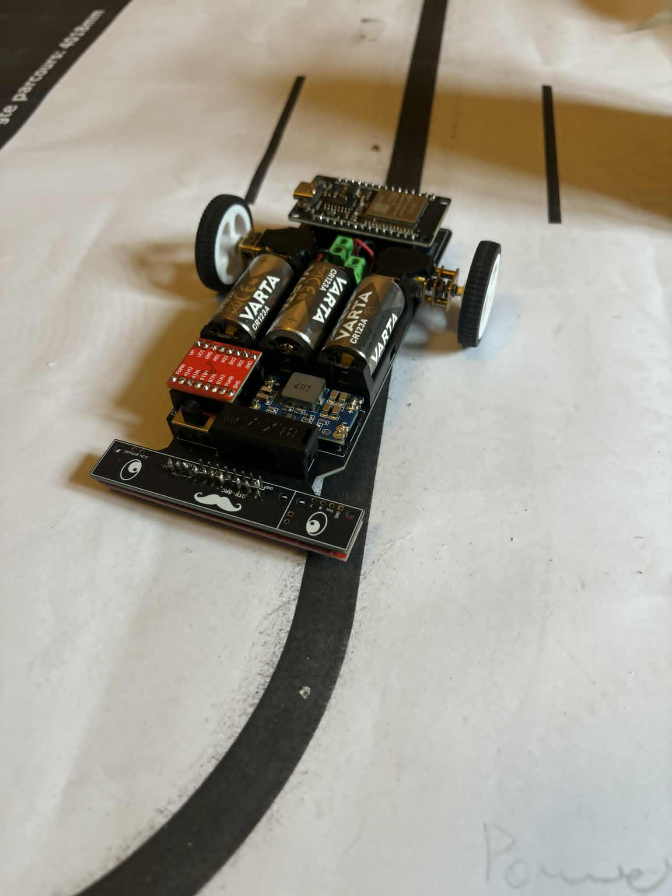

# LineFollower

lege repository die je als template kan gebruiken om een eigen repository te starten voor uw linefollower project

  
## specifications

microcontroller: ESP32 DEVKIT V1

motors: N20 DC 12V 1000tpm

h-bridge: TB6612FNG

sensors: QTR-8A

batteries: 3 x CR123A

wireless communication: wifi via Arduino Cloud

distance sensor - motors: 9 cm

weight:

speed: 

